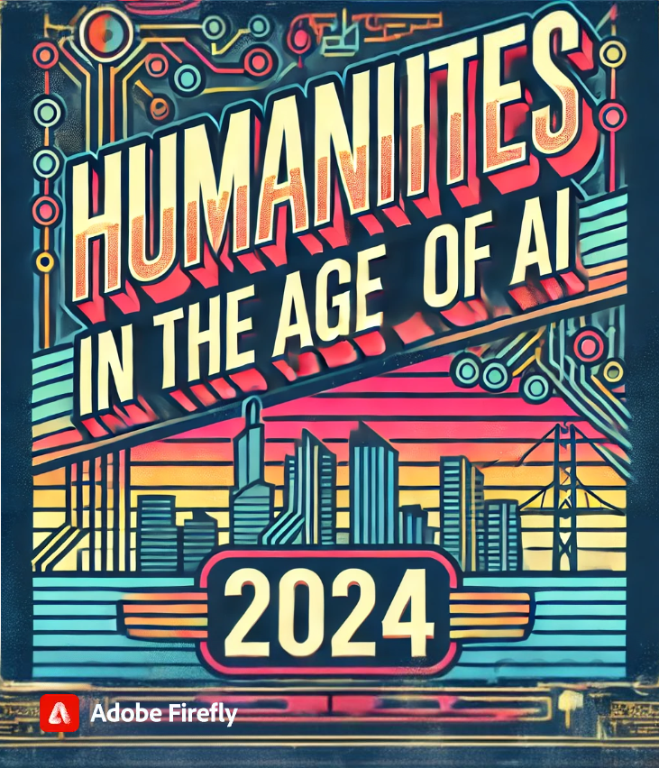

-   **Course Number:** ENG 6806
-   **Email:** anastasia at ucf

## Contents

- [Contents](#contents)
- [Course Description](#course-description)
- [Course Objectives](#course-objectives)
- [Materials and Texts](#materials-and-texts)
- [Evaluation and Grading](#evaluation-and-grading)
- [Asynchronous Online Course Structure](#asynchronous-online-course-structure)
- [Weekly Schedule](#weekly-schedule)
  - [Week One: Textual - Histories (Monday, August 19)](#week-one-textual---histories-monday-august-19)
  - [Week Two: Textual - Generation (Monday, August 26)](#week-two-textual---generation-monday-august-26)
  - [Week Three: Textual - Sources (Monday, September 2)](#week-three-textual---sources-monday-september-2)
  - [Week Four: Textual - Combinatory (Monday, September 9)](#week-four-textual---combinatory-monday-september-9)
  - [Week Five: Visual - Aesthetics (Monday, September 16)](#week-five-visual---aesthetics-monday-september-16)
  - [Week Six: Visual - Art and Creativity (Monday, September 23)](#week-six-visual---art-and-creativity-monday-september-23)
  - [Week Seven: Visual - Photography and Realism (Monday, September 30)](#week-seven-visual---photography-and-realism-monday-september-30)
  - [Week Eight: Visual - Perceptions (Monday, October 7)](#week-eight-visual---perceptions-monday-october-7)
  - [Week Nine: Procedural - Code and Rules (Monday, October 14)](#week-nine-procedural---code-and-rules-monday-october-14)
  - [Week Ten: Procedural - Digital Humanities (Monday, October 21)](#week-ten-procedural---digital-humanities-monday-october-21)
  - [Week Eleven: Procedural - Art and Play (Monday, October 28)](#week-eleven-procedural---art-and-play-monday-october-28)
  - [Week Twelve: Procedural - Hypertext (Monday, November 4)](#week-twelve-procedural---hypertext-monday-november-4)
  - [Week Thirteen: Textual-Visual-Procedural (Monday, November 11)](#week-thirteen-textual-visual-procedural-monday-november-11)
  - [Week Fourteen: Applications: Art (Monday, November 18)](#week-fourteen-applications-art-monday-november-18)
  - [Week Fifteen: Applications: Humanities (Monday, November 25)](#week-fifteen-applications-humanities-monday-november-25)
  - [Final Reflection (Due December 7)](#final-reflection-due-december-7)

## Course Description

This course offers an exploration of the theory and practice of
artificial intelligence and its use in textual, visual, and procedural
arts and humanities work. The course is divided into three units,
reflecting these primary areas of the usage of AI, and engaging with
both creative examples and theoretical critiques of that usage:

-   **Textual.** In the textual unit, we will consider the history of
    textual generation and analysis, with attention to both the
    exploitation of and applications for archives, literature, and
    historical work. Students will engage in textual generation and textual analysis.
-   **Visual.** In the visual unit, we will explore visual generation
    and its challenges for authorship and meaning, with attention to
    parallel discussions in modern and postmodern media. Students will
    engage in generation for both visual material and for image-texts
    and consider the changing perspectives on artists and creativity.
-   **Procedural.** In the procedural unit, we will dive into the layer
    of code, with attention to the history of generative practices in
    both electronic literature and digital humanities usage. Students
    will co-author code and interactive projects with AI models,
    focusing on use cases for libraries, archives, museums, and artistic
    expression.

The final weeks will focus on combinatorial practices of
textual-visual-procedural generation that bring these methods together
with human imagination towards arts and humanities problems. Each week,
plan on following the module for all asynchronous activities. Each
module will be divided into three sections:

-   **Weekly Readings.** Complete this combination of primary and
    secondary texts prior to starting the making exercise. The full
    schedule of required readings is listed in the syllabus: additional
    recommended readings will be provided in each module.
-   **Generative Exercises.** Each week's generative exercise will
    involve experimenting with a different tool for AI: guidance will be
    provided on configuring and getting started with the tool, and
    students will be required to purchases subscriptions to OpenAI for
    some exercises.
-   **Reflective Discussion.** A weekly online discussion will provide
    the opportunity to share the process of making: the emphasis is not
    on "success" or "failure," but on critiquing the process and
    products through a theoretical lens.

## Course Objectives

-   Engage in both critical and creative projects exploring the pitfalls
    and potentials of large language models in visual, textual, and
    procedural work
-   Understand the history and implications of computer-augmentation
    across the arts and humanities
-   Make connections between contemporary policies around AI and past
    debates and perspectives on other technologies
-   Use large datasets to solve problems in the arts and humanities,
    with attention to evaluating and critiquing these methods alongside
    more traditional approaches in these disciplines
-   Use and analyze the application of AI generative methods for
    textual, visual, and procedural work.
-   Critique policies and uses of AI in various communities and contexts
    (the workplace, academia, etc.)

## Materials and Texts

This course requires a mix of applied and theoretical readings,
including some open access materials. The primary texts include:

-   Melanie Mitchell. *Artificial Intelligence: A Guide for Thinking Humans* (Farrar, Straus and Giroux, 2019). (Physical copy on reserve in the UCF Library)
-   Matthew Kirschenbaum. *Bitstreams: The future of Digital Literary
    Heritage* (University of Pennsylvania Press, 2021). [Unlimited Access Ebook via UCF Library](https://go.openathens.net/redirector/ucf.edu?url=https%3A%2F%2Fdoi.org%2F10.2307%2Fj.ctv1f45qbq)
-   Safiya Noble. *Algorithms of Oppression: How Search Engines Reinforce Racism.* (NYU Press, 2018). [Unlimited Access Ebook via UCF Library](https://go.openathens.net/redirector/ucf.edu?url=https%3A%2F%2Fdoi.org%2F10.2307%2Fj.ctt1pwt9w5)
-   Joanna Zylinska. *The Perception Machine: Our Photographic Future
    between the Eye and AI* (MIT Press, 2023). [Unlimited Access Ebook via UCF Library](https://search.ebscohost.com/login.aspx?direct=true&AuthType=cookie,shib&db=nlebk&AN=3549494&authtype=shib&site=ehost-live&scope=site&custid=current&groupid=main&authtype=shib)
-   Michael L. Littman. *Code to Joy: Why Everyone Should Learn a Little Programming* (MIT Press, 2023). [Unlimited Access Ebook via UCF Library](https://ebookcentral.proquest.com/lib/ucf/detail.action?docID=30319504)

In addition, each module includes samples, tutorials, and resources to
guide the week's making experiments. Relevant recent articles will be integrated regularly to encourage awareness of the current discourse and the field.

## Evaluation and Grading

| Points | Assignment Summary                                                                                                      | Due Date    |
|--------|-------------------------------------------------------------------------------------------------------------------------|-------------|
| 5      | **Activity Verification** - Complete the brief survey posted on Webcourses as soon as possible to confirm your enrollment in the course. As this is required by the university, please attend to it as soon as possible at the start of classes. | Friday, August 23rd |
| 75     | **Generative Exercises** - Weekly discussions will consist of making, sharing, and reflecting on the process of exploring. We will work from tutorials and try a new form every week, with reflective questions connecting our process of making to the theoretical frameworks and provocations offered by our readings. | Weekly |
| 20     | **Reflection** - During the final exam week, students will complete a reflective essay on their journey, with particular consideration to next steps and potential future applications of the making mechanisms introduced throughout the semester. This reflection should include AI-generated material alongside materials produced directly by the student. | Tuesday, December 7th |

Students can access their grades and feedback at any time using the
Grade Book function of Webcourses. All assignments will be submitted
through Webcourses. Plan on checking the site at least twice a week for
updates and assignment information. Grades are calculated out of 100
following a standard letter scale.

Late work is accepted without penalty for one week after the listed
deadline. If circumstances require extension beyond that deadline,
please reach out to the instructor immediately.

There is one extra credit making exercise option available at the end of
the semester for those who miss a weeek. Grades will be available
through Webcourses and updated weekly.

## Asynchronous Online Course Structure

This course uses a fully asynchronous online format, and relies upon
students to complete all readings, engage with both course lectures and
other online videos, and join in on course discussions. All assignments
are due at the close of their listed module, but will be accepted with
no penalty through the next listed deadline. Once an assignment closes,
late work will not be accepted unless an additional extension has
already been approved by the instructor: please reach out early if
circumstances will require additional time!

-   The course has no synchronous meeting requirements: however,
    students are encouraged to engage in optional check-in meetings to
    think through their process and growth. Optional synchronous
    meetings will be scheduled based on the poll conducted in the first
    week of class.
-   Office hour assistance is additionally available both through text
    on Webcourses messages and via Zoom: Zoom is recommended for
    advanced technical problems, where screen-sharing might be helpful
    to resolving errors.
-   Students will need access to a reliable internet connection and
    computer to participate in this course. Due to some of the AI tool
    installation needs, administrative access to the system is required
    to complete assignments.
-   In the event of an emergency or medical challenge, additional
    flexibility beyond the grading guidelines is available: when
    anticipated, students should reach out to the instructor as soon as
    feasible to form a plan or discuss an incomplete if needed.

## Weekly Schedule

### Week One: Textual - Histories (Monday, August 19)

[Tutorial: Eliza and Bots](weekone.md)

-   *Bitsreams* - Introduction; Archives Without Dust
-   Berry, D. M. (2023). The Limits of Computation: Joseph Weizenbaum and the ELIZA Chatbot. Weizenbaum Journal of the Digital Society, 3(3). [https://doi.org/10.34669/WI.WJDS/3.3.2](https://ojs.weizenbaum-institut.de/index.php/wjds/article/view/106)
-   **Due: Activity Verification (Friday August 23rd)**
-   **Generative Exercise One: Conversation**

### Week Two: Textual - Generation (Monday, August 26)

[Tutorial: Interfaces](weektwo.md)

-   *Bitstreams* - The Poetics of Macintosh; The Story of S; Coda
-   [Emerson, Lori, 'Interfaced', in Matthew Rubery, and Leah Price (eds), Further Reading (2020; online edn, Oxford Academic, 5 Mar. 2020).](https://loriemerson.net/2020/02/07/interfaced/)
-   [Bogost, Ian. "AI Cheating Is Getting Worse." The Atlantic. August 19, 2024. ](https://www.theatlantic.com/technology/archive/2024/08/another-year-ai-college-cheating/679502/)
-   **Generative Exercise Two: Interface Critique**

### Week Three: Textual - Sources (Monday, September 2)

[Tutorial: Reading Across Texts](weekthree.md) 

-   *Artificial Intelligence* - Part I: Background
-   Underwood, Ted. "A Genealogy of Distant Reading." *DHQ: Digital Humanities Quarterly* 11.2 (2017). [http://digitalhumanities.org:8081/dhq/vol/11/2/000317/000317.html](http://digitalhumanities.org:8081/dhq/vol/11/2/000317/000317.html).
-   [Kirschenbaum, Matthew. "Prepare for the Textpocalypse." The Atlantic. March 8, 2023.](https://www.theatlantic.com/technology/archive/2023/03/ai-chatgpt-writing-language-models/673318/)
-   [Bhatia, Aatish. "When A.I.'s Output Is a Threat to A.I. Itself." The New York Times. August 25, 2024.](https://www.nytimes.com/interactive/2024/08/26/upshot/ai-synthetic-data.html)
-   **Generative Exercise Three: Textual Analysis**

### Week Four: Textual - Combinatory (Monday, September 9)

Tutorial: Combining Texts

-   *Artificial Intelligence* - Part II: Looking and Seeing
-   Mackay, James and Polina Mackay. “Experiments in Generating Cut-up texts with Commercial AI”, Electronic Book Review, June 9, 2024, [https://doi.org/10.7273/gkrg-5d74](https://electronicbookreview.com/essay/experiments-in-generating-cut-up-texts-with-commercial-ai/).
-   **Generative Exercise Four: Cut-up Texts**

### Week Five: Visual - Aesthetics (Monday, September 16)

Tutorial: Mash-ups and Remixes

-   *The Perception Machine* - Introduction; Does Photography Have a Future?
-   *Artificial Intelligence* - Part III: Learning to Play
-   **Generative Exercise Five: Playful Generation**

### Week Six: Visual - Art and Creativity (Monday, September 23)

Tutorial: Archival Images

-   *The Perception Machine* - Screen Cuts; From Machine Vision to a Nontrivial Perception Machine
-   *Artificial Intelligence* - Part IV: Artificial Intelligence Meets Natural Language
-   **Generative Exercise Six: Meaningful Images**

### Week Seven: Visual - Photography and Realism (Monday, September 30)

Tutorial: Video

-   *The Perception Machine* - AUTO-FOTO-KINO; Can You Photograph the Future?
-   *Artificial Intelligence* - Part V: The Barrier of Meaning
-   **Generative Exercise Seven: Expansive Imaginaries**

### Week Eight: Visual - Perceptions (Monday, October 7)

Tutorial: Multimodal Analysis

-   *The Perception Machine* - "Loser Images"; Conclusion
-   *Code to Joy* - Telling Computers What to Do
-   **Generative Exercise Eight: Visualizations**

### Week Nine: Procedural - Code and Rules (Monday, October 14)

Tutorial: Visual Studio Code

-   *Code to Joy* - The What of Programming
-   *Algorithms of Oppression* - The Power of Algorithms
-   **Generative Exercise Nine: Tools**

### Week Ten: Procedural - Digital Humanities (Monday, October 21)

Tutorial: GitHub CoPilot

-   *Code to Joy* - Sequencing Commands
-   *Algorithms of Oppression* - A Society; Searching
-   **Generative Exercise Ten: Structured Data**

### Week Eleven: Procedural - Art and Play (Monday, October 28)

Tutorial: Iteration and Design

-   *Code to Joy* - Splitting on Conditionals
-   *Algorithms of Oppression* - Searching for Black Girls
-   **Generative Exercise Eleven: Games**

### Week Twelve: Procedural - Hypertext (Monday, November 4)

Tutorial: Working Across Interfaces

-   *Code to Joy* - Storing in Variables
-   *Algorithms of Oppression* - Searching for People and Communities
-   **Generative Exercise Twelve: Interactive Object**

### Week Thirteen: Textual-Visual-Procedural (Monday, November 11)

Tutorial: Multimodal Development

-   *Code to Joy* - Consolidating Into Loops
-   *Algorithms of Oppression* - Searching for Protections
-   **Generative Exercise Thirteen: Portfolio of Experiments**

### Week Fourteen: Applications: Art (Monday, November 18)

Tutorial: Debugging

-   *Code to Joy* - Defining Functions
-   *Algorithms of Oppression* - Future of Knowledge in Public
-   **Generative Exercise Fourteen: Experimental Interactive Art**

### Week Fifteen: Applications: Humanities (Monday, November 25)

Tutorial: Iteration and Design

-   *Code to Joy* - Combining Code and Data; Programmable World
-   *Algorithms of Oppression* - Future of Information Culture; Conclusion
-   **Generative Exercise Fifteen: Public Humanities Prototype**

### Final Reflection (Due December 7)

-   Submit & complete your Final Reflection, as
    well as any approved late work, by December 7th!
-   **Extra Credit Making Exercise: New Tools for Generation**
