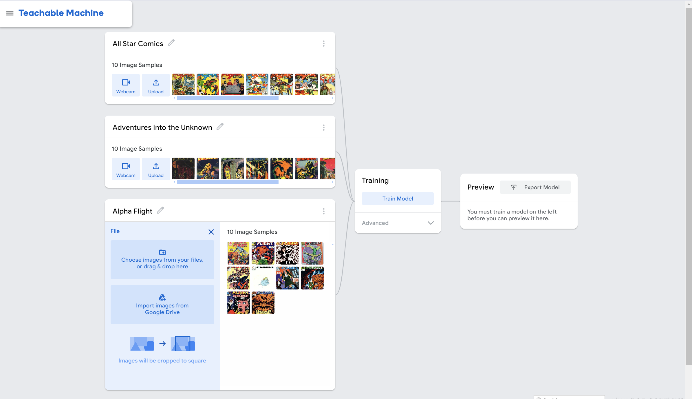
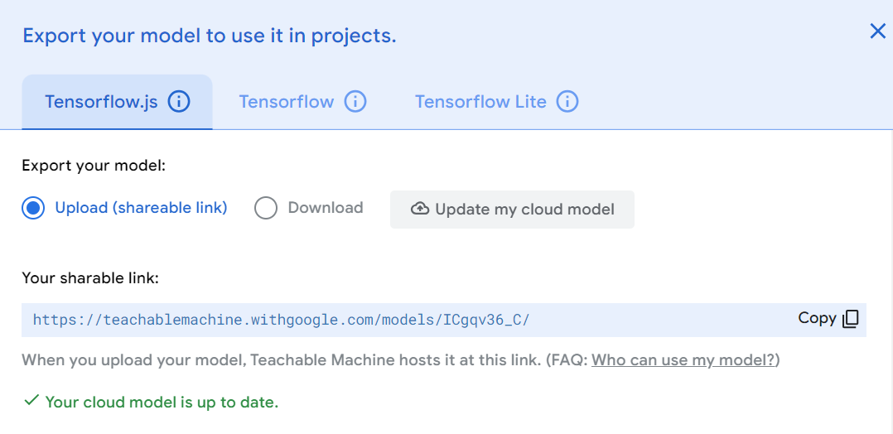

## Tutorial: Image Classification

We've been working a lot with the output of models: now, as we prepare to shift our attention from images to code, we're going to get a bit more hands-on with the models themselves by introducing a visual dataset for comparative analysis. This is a tools-intensive week, as it will start us on the path towards building and controlling our generative AI tools, inputs, and outputs much more directly.

### Working with Teachable Machine

First, gather at least 10 sample images from at least 3 different categories. For my demo dataset, I'm using cover images from distinct titles of [comic book covers](https://www.coverbrowser.com/). You might try different art styles, architecture, palettes, animal types, etc. Remember to think about these as distinct sets - you'll need to categorize your inputs into specific labels, which in turn the model will try to place content.

Next, [launch Teachable Machine](https://teachablemachine.withgoogle.com/train), a simple visual interface for training machine learning models that can be exported to TensorFlow, a feature we'll be playing with more as we take more control of the tools. Select **New Image Project -> Standard image model** to start training your model.

Upload the images from each category, labeling them as you go (as shown above). Then, train the model and export it by selecting the options **Tensorflow.js** and **Upload (shareable link).** Copy the resulting link, as shown in the screenshot:

Next, we're going to set up a tool that will let you test your model against other images that fall in the same categories. This tool is one I built that is going to give you a simple framework - you only need to replace one line of code to make it work. Load [the sample application](https://openprocessing.org/sketch/2382215), select *</>*, and replace the URL in line 4 with your URL. Test several different examples of images that fit in your categories, and take a screenshot of the resulting confusion matrix to share the results.

If you created a more complex model, you might need to edit the code to make it work. To do that, copy the existing code into ChatGPT and ask for the specific changes you need: I will demo this process of iteration during the live session.

### From Teachable Machine to Application

Finally, explore an existing usage of these libraries from the [Tensorflow.js gallery](https://github.com/tensorflow/tfjs/blob/master/GALLERY.md) - note that since this is a crowdsourced list, quality and usability may vary, so I recommend trying several to find one or two of interest. 

Using these as inspiration, launch your generative AI tool: for this process, I recommend selecting the **ChatGPT 4o with canvas** model. Copy your existing code from the Open Processing window with a starting prompt, asking the tool to redesign this output to more resemble your goals: for instance, you could ask it to switch from visualizing a confusion matrix to showing you more information about the model, as in the [visualizations covered in the library](https://www.npmjs.com/package/@tensorflow/tfjs-vis), or you could build an entirely different application, like a tool that takes video input and categorizes it using your model.

Don't worry if your resulting application is completely buggy or doesn't work - just document the process of trying to convince the computer to build what you need, keeping in mind our opening readings from *Code to Joy* as you work.

