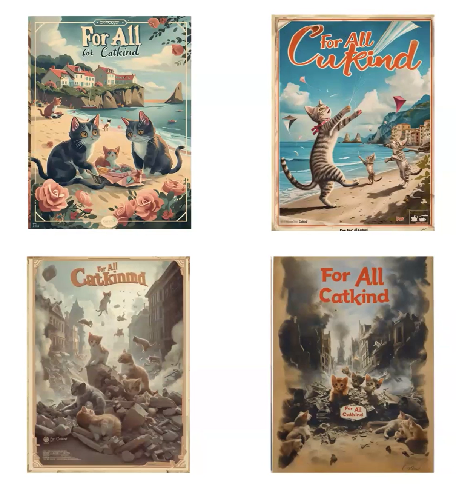

## Tutorial: Mash-ups and Remixes

For this week's exercise, you'll be taking inspiration from both the zine-style, image-driven preface to Joanna Zylinska's *The Perception Machine: Our Photographic Future between the Eye and AI* and the examples from the ELO panel ["Worlds Remunged: The Pastiche and Parody of Generative AI"](https://stars.library.ucf.edu/elo2024/algorithmsandimaginaries/schedule/26/) with projects by artist-scholars Mark C. Marino, Siobhan O'Flynn, Alex Mitchell, and Rob Wittig. As this week's readings have discussed, generative imagery is particularly contentious, and the availability and ease of use of these tools has serious implications for work and communication broadly. While working through this process, keep in mind Melanie Mitchell's discussions of how the model relates to objects, and iterate your prompting to be as clear and specific as possible. 

### Text to Image Experimentation

This week, you'll be sharing a 3 page zine riffing on the themes and structure of Zylinska's work. To construct the zine, you should generate a wide range of images and iterate through to create a set of images that, when remixed and juxtaposed on the page with your own textual elements, speaks to your own perception of generative AI imagery. The textual elements might include quotes from the readings or your own provocations on the potential and concerns raised by these tools.

If you have purchased the recommended subscription to ChatGPT, I recommend using DALL-E for the generative image work in this exercise. However, you can also try other image generators with free options and compare: Adobe Firefly, Playground.AI, and Midjourney are all useful options. If you try more than one, consider trying the same prompt to see the contrast in results. You might also find it helpful to reference Ian Demsky's ["My Month with Midjourney"](https://electronicbookreview.com/essay/my-month-with-midjourney/) for examples of successful iteration.

As you work, try:

- Generating both abstract and realistic images. Think about how words associated with emotions or concepts are interpreted, and what that suggests about the images in the dataset and how these concepts have been tagged by people in the past.
- Generating with and without text. You might find that generating images with embedded text (such as those shown here from Siobhan O'Flynn's "For All Catkind" project) is still suffering from errors, but every new version of these models is working to address those problems.
- Providing reference images. Just as with our work in text, you can provide reference images to the model using the attachment option. Try using either your own or public domain photos and art to guide the generation toward useful outcomes.
- Working with ChatGPT to revise prompts. Consider asking it to rewrite your image requests, particularly if you aren't getting the types of results you are expecting or desire.
- Playing with copyright. As our readings this week discuss, there are often guardrails on models around the use of copyrighted characters and trademarks: however, that knowledge is built into the model. 

### Making your Zine

Once you've decided on your "lens" on generative imagery for this project, plan out the 3 page zine as an imaginary print project. You can use large images and text to make graphic statements, as Zylinska's own work does. To have sufficient interesting images for layering in the zine, you'll likely need to generate a large set of images (30-50 or more) and curate, edit, and remix. To create the zine, you can use any software you are comfortable with to lay out the generated images and your textual elements on the page: Photoshop, Word, Canva, or any similar tools will work fine. Don't worry about perfectionism - the goal is to play with the process and try to control the generation to create results that fit your vision. Share the zine and your reflection on the process in this week's discussion.