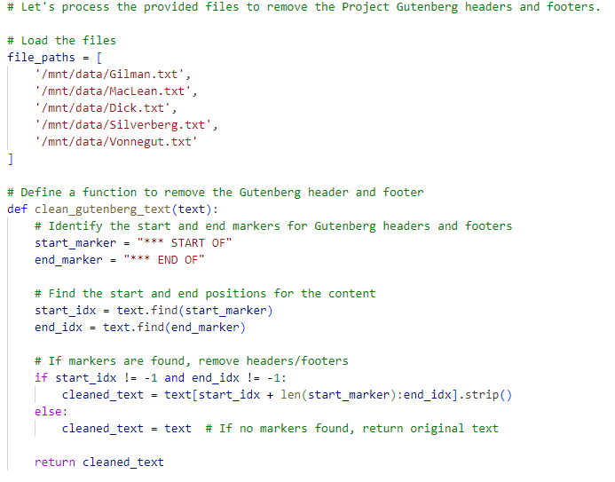
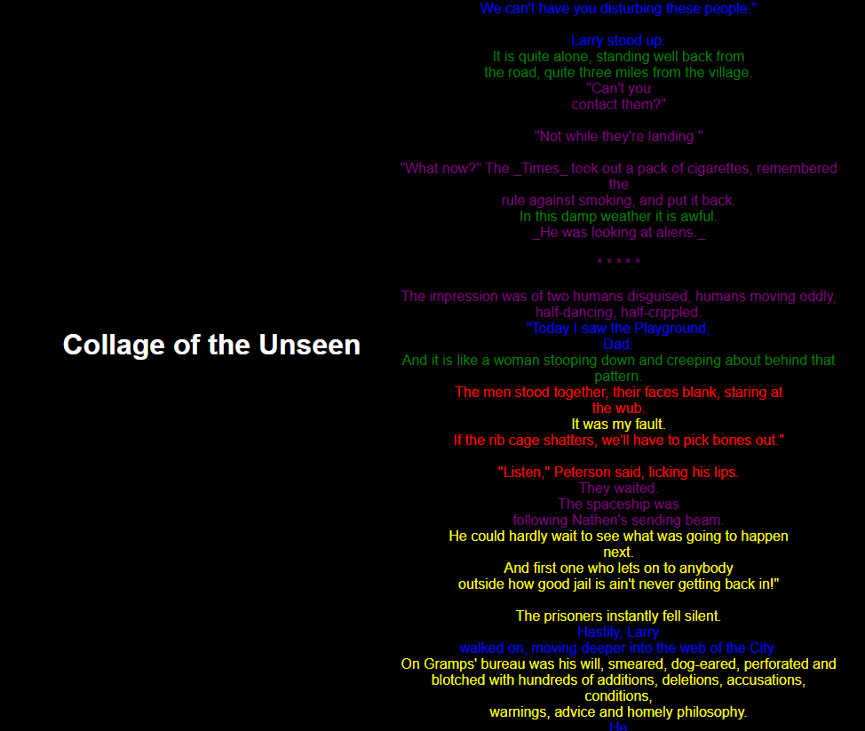

## Tutorial: Combinatorial Texts

For this week's exercise, you're going to be taking influences from NaNoGenMo but work smaller to create a procedurally-generated, combinatorial short story. This prompt draws on some of the controversy around NaNoWriMo and, of course, the questions of AI authorship and particularly the questions of who's doing the authoring that came up when you all were "generating" poetry earlier this semester. As you were reading all the generated across the discussion board, I hope everyone noticed that some of the most successful were those that provided kind of strong existing materials and cues from existing authorship, kind of specificity of source material, rather than kind of just relying on whatever text is generated to response. Thus this exercise will require combining the type of work we've done for our last two weeks: you'll still be generating text, but instead of asking the LLM to produce text itself, you'll be drawing from a number of public domain or creative commons source texts and using procedural methods to combine them. As with last week, I recommend selecting your source texts from Project Gutenberg, but you are welcome to select any set of short stories appropriately licensed for this usage.

As we are getting into more advanced usage, you will now find that it's going to be nearly impossible for you to complete most assignments without investing in a subscription. You will run out of free queries, even working across the models, and you're going to hit lots of limits in output and usage. I recommend going with a two-month subscription to ChatGPT, as that is what I will be demoing on during the live sessions. However, Claude is another very capable tool for this type of work. Note that the context window and the manipulation of files is going to be key going forward: this week's exercise will bring that into focus as we're going to take a look "under" the interface and see how this process unfolds.

### Cut and Paste Text

For examples of the type of work we're going to be creating here, start by [reading the overview on the NaNoGenMo repository](https://nanogenmo.github.io/).  I also recommend checking out the NaNoGenMo works featured in the Electronic Literature Collection Volume 4, particularly [Lee Tusman's "Pomelo: A Book of Instructions and Drawings" inspired by Yoko Ono's work](https://collection.eliterature.org/4/pomelo-a-yoko-ono-grapefruit-generator); [Delacannon's "Old School Dungeon Crawler GameBook Generator"](https://collection.eliterature.org/4/oldschool-dungeon-crawler-gamebook-generator); [Nick Montfort's minimalist experiment "consequence"](https://collection.eliterature.org/4/consequence); [Liza Daly's kinetic "A Physical Book"](https://collection.eliterature.org/4/a-physical-book). These are all much more ambitious projects than you'll be taking on this week, but they will give you an idea of what is possible!

Next, source at least five text files to work with for your project. Plain text files will work best. For my examples, I used a set of science fiction short stories found in Project Gutenberg. As before, you'll need to ask it to pre-process the texts: however, this week, make sure to check the output as you go. When working with ChatGPT, select "View Analysis" after you ask for pre-processing. For instance, here's a sample of the Python code that ChatGPT 4.0 generated in response to my request to pre-process the Project Gutenberg files and remove the header and footer text: you can see the full script created for this stage [here](sample_cleaning.py). 

Try to use the information you see to debug problems by asking ChatGPT for specific changes that might lead to better outcomes: this will be a challenge, but it can lead to great results!

Once you have at least five cleaned files that you're happy with, start asking ChatGPT to transform and/or combine the text(s) using different methods. Take a look through [Zach Whalen's NaNoGenMo Workshop](https://zachwhalen.notion.site/NaNoGenMo-Workshop-b984ee239e9e4cb8a99eb69fda617204) and this week's readings for ideas on how to approach combining your texts - and yes, you can explain the project to ChatGPT and ask it for suggestions as well. Here's a few of the methods you might try, both on individual texts and on re-mixed texts:

- *Find and Replace* - Consider replacing specific words, swapping character names between stories, changing characters from humans to cats (and so on), or using a deterministic method: [Zach Whalen's overview has several examples](https://zachwhalen.notion.site/Find-and-Replace-3eb80d9ef13048469e37a43beb193047).
- *Erasure / Lipogram* - Try to exclude a letter of the alphabet from your texts, and consider the results. You might have to get creative with this or decide to embrace some of the nonsense that will likely remain. You can also eliminate certain words or categories of words.
- *Cento* - A cento is a text composed entirely out of other texts: ask ChatGPT to work across your texts to assist with this type of combinatorial process. For ideas on how to think about this type of constraint, take a look at [Christopher Higgs on the history of the Oulipo and "potential" literature](https://agnionline.bu.edu/essay/the-annoying-lacuna-one-unofficial-history-of-the-oulipo/).

### Shareable Story

Continue iterating through at least five different approaches until you have a single "story text" that you are happy with. Some things aren't going to work as well when run through the ChatGPT interface as they would if you exported the code yourself, but don't worry about that this week: if you run into an error involving external libraries, ask ChatGPT to try a simpler solution. 

You can also check out the [Markov inspired](markov.html) generator we made as a group during the live session.

Once you have your story text, ask ChatGPT to convert it to an HTML format that's better for display. This doesn't need to be fancy, but think about how it might have meaning. For example, shown here is one iteration of my test, which is a Cento and includes lines from each story highlighted in different colors based on their original source text: I accomplished this by asking ChatGPT to add markers when building the Cento, then replace those markers with font colors after converting the file. Share the final HTML file as well as screenshots from your process back in this week's discussion.
