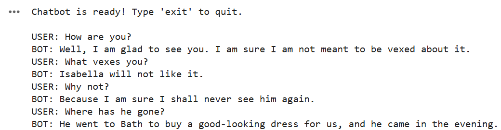

## Tutorial: Back to Bots

As we're approaching the end of the semester, we're going to think about how generative AI will influence complex workflows. This week, we'll build a simple portfolio combining our experiments thus far, and in the process combine new approaches (such as music generation and code conversion) with the workflow we've developed over the last few weeks building interactive content for the web.

### Fine-Tuning a Model

Recall the Eliza Bot we "spoke" with at the beginning of the class: Eliza's code uses the same fundamental structures as you've been reading about over the last few weeks in *Code to Joy.* Her set of replies is thus fundamentally very limited to what is pre-scripted. We could easily build our own version of Eliza at this stage, but instead of working with an "old-school" bot, we're going to add on by using the skills you've gained with scraping and preparing datasets to fine-tune our own more responsive "bot." 

Here's the prompt I started with, using the o1-preview reasoning model to get the initial code for every part of the problem. You'll need to work from a similar prompt iteratively, looping through each section of the task until you get results that enable you to move forward:

- *I want to fine tune a recent GPT model in Tensorflow to build a chatbot that responds based on dialogue extracted from a set of creative commons novels. I'd like to grab the public domain files from a single author on Project Gutenberg using a scraper, work from a set of text files, process them for this purpose, and test the chatbot in Google Colab. Can you help?*

Here's the steps that ChatGPT o1 suggested to me, with some notes on how you might approach them:

- **Select and Download Texts from Project Gutenberg** - I suggest picking a single author for this, ideally someone with a lot of interesting dialogue. If you run into problems with the training process below, you might have tried to pull too many novels - go back and experiment and cut down to a single novel if needed.
- **Process the Text Files to Extract Dialogues** - Remember, not all novels use "" to indicate dialogue. Take a look at how conversation is marked in the novels you've selected, and iterate through the extraction process until you get the material you are looking for.
- **Prepare the Dataset for Training** - Dialogue has to be processed into input-output pairs to be usable by the bot: the Python code will try to pair sequential dialogue appropriately. Save the dataset as a JSON file to check over it before you train, and make sure it looks like you have something usable.
- **Choose and Set Up a GPT Model in TensorFlow** - For this, we'll be using an open source model (so that we don't have to pay even more to fine-tune a model). This means the results won't be as impressive as if you were fine tuning the most recent model, but that's OK! GPT2 or similar works well enough to see this is in action.
- **Fine-Tune the Model** - Expect the most errors and frustration at this stage - remember, fine-tuning is basically running a loop across all the data you've gathered over and over again and putting it into context with the model you've selected. If you find it takes too long or crashes the RAM on Colab, ask to simplify the training (fewer epochs, etc.)
- **Test the Chatbot in Google Colab** - For this exercise, we're not going to deploy our model externally: that would require hosting it, like OpenAI does with ChatGPT. Instead, you can run the Chatbot through test prompts directly in Python on Colab. Screenshot results, and see how your interaction proceeds - expect to hit lots of limitations given the constraints of this minimal training, but hopefully you'll also get some emergent, playful results!

When complete, your sample output will look something like this one from my AustenBot - you can try it for itself [using the Colab notebook](https://colab.research.google.com/drive/1QmCgdlzBdwmHtm964zUiS3UiotVyxK7l?usp=sharing). This bot is still fairly limited (we gave it a small dataset using GPT2, an older model) - however, it offers some insights into how you might build on a creative dataset towards an interactive experience. You can also use this notebook to help you build and debug your own bot.

### Reflecting on Chat

Compare this experience to the bot interactions we had at the start of the semester: how has your understanding of, and expectation of, these bots changes? Where do the limitations of the dataset and the model come out, and how can you understand that through the lens of the readings and experiments we've done across the semester?