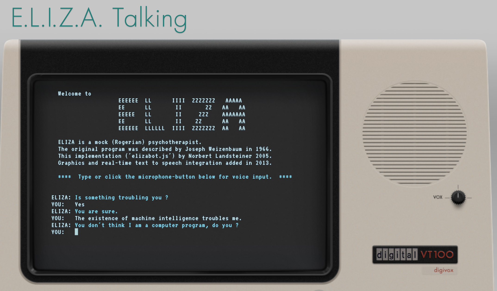

## Tutorial: Eliza and Bots

As this is the first week of class, the goal is to get everyone comfortable with working with the simplest and currently most common interface for generative AI: text prompts, or "chat." ChatGPT has popularized this format and brought it to a wide audience, but bots are a much older concept. You might have encountered them on help websites where they're often a source of frustration in tech support systems and customer service. Those are more obvious bots with the goal of being particularly conversational, whereas ChatGPT and similar interfaces are really just providing you with a context for entering text prompts. Conversational input is actually often not as productive as something more optimized, which we will be talking about as we move forward.

To start us off, I want you to have two experiences. First, with a historic chatbot, Eliza, the program you are introduced to in the critical section of this module in this week's readings. Second, with a modern interface. For this course, you do have a decision to make regarding a subscription to ChatGPT or a similar service: a subscription is not required, but as we move through tools this semester, you might hit usage limitations or get frustrated with the access provided by free tools. One option for some assignments (including this one) will be to use the University's access to CoPilot.

### Conversations, Two Ways

For your first virtual therapist encounter, spend at least 15 minutes interacting with [<<E.L.I.Z.A. Talking>>](https://www.masswerk.at/eliza/). This is one of many iterations on Norbert Landsteiner's version of the original Weizenbaum ELIZA program from our readings: it features a text-to-speech library, which adds to the "chat" capacity of the session. Try talking to ELIZA about topics related to your thoughts after this first week's lecture and readings, and particularly consider asking questions related to the human and the machine (as shown in the screenshot here).

For your second encounter, use any current generative AI chat interface. The most popular is the free version of [ChatGPT](https://chatgpt.com/), but you can also use UCF's CoPilot access instead (as noted above). If you are fairly familiar with both, consider trying another model such as [Google Gemini](https://gemini.google.com/app) or [Anthropic Claude](https://claude.ai/) For these models, start with a prompt to set the chat to respond similarly to Eliza. I recommend something along the lines of: "For this conversation, please reply as if you are a therapist trained in person-centered or Rogerian therapy, akin to the ELIZA bot." 

Again, spend at least 15 minutes, ideally more, conversing before you go on to the discussion post. Screenshot any interesting or surprising moments, and try similar conversation and compare the results. Notice how the level of repetition varies, and which words seem most associated with the responses that you get from each system.

### Discussion

After chatting with "Eliza" and another bot of your choice from this week's exercise, share your experience with your peers. Since this is our first week, please include a brief introduction as well as any context in which you've previously worked with generative AI that might be relevant to how you're approaching this semester. 

Note any surprising moments in both encounters and try to draw comparisons between them where you think about this week's lecture and readings which focus us on situating generative AI in a history. A history that we will be developing a better understanding of, especially throughout the first section of this course, even as we engage with very current and rapidly changing generative AI tools. 
