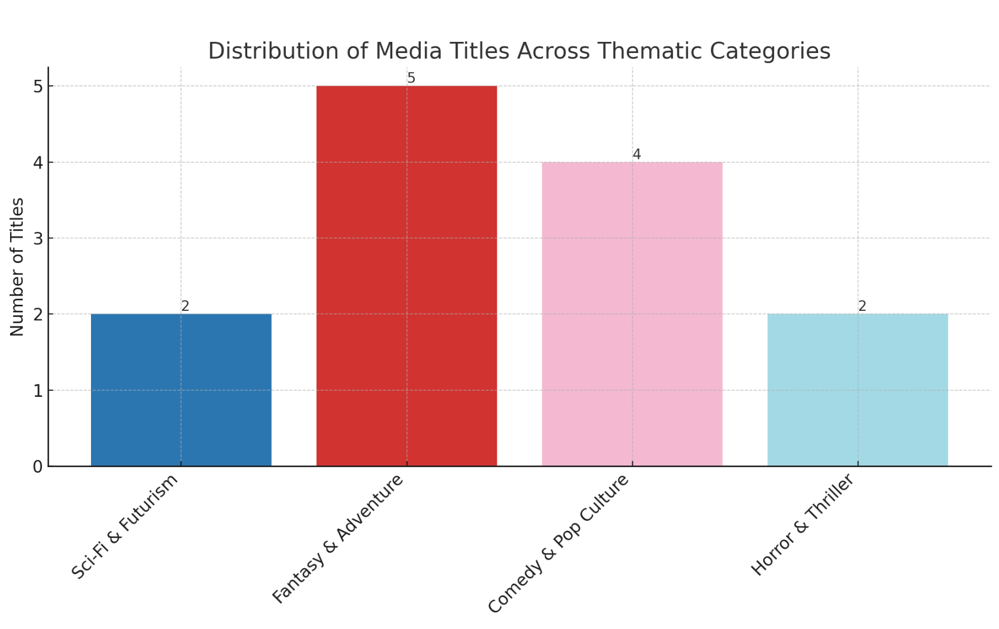

## Tutorial: Archival Images

This week, we're going to think about the challenges of translation from one medium to another, and explore how LLMs process or "see" complex images. For this project, I recommend working with images you find interesting that are related to your work in some way - assemble these as a collection that speaks to a theme or subject that has significant complexity. If you need ideas, consider working from an existing archive, such as image collections within the [Internet Archive](https://archive.org/details/image) or the [Library of Congress](https://www.loc.gov/pictures/). Consider the work discussed in our readings, [Archive Dreaming](https://refikanadol.com/works/archive-dreaming/) - how might generative AI change how you approach a larger visual cultural dataset? While we won't be working at that scale for this exercise, consider the broader projects that might build on these methods.

### Image to Text Translation

Iterate through a series of prompts to build from analyzing single images to a larger set. You will need the subscription to provide a sufficient number of images at once (through the upload function - just select multiple files in a folder) to see patterns. Work from simpler images (with or without text) to more complex and potentially confusing images. These can be photographs or, as with our readings, not-photographs of any kind - a set of screenshots, archival scans, hand-written documents, etc.

Here's a few examples of questions to ask about single sets and images to prompt different types of translation:

- **Describe what you see in this image.** Follow up about material elements and specific details in the image. If there's an art or craft depicted, ask about the process or construction.
- **Write alt-text for this image.** Keep in mind accessibility standards. To work more broadly, ask it to extrapolate and provide introductory descriptory text for the set of images.
- **Pull out and describe key features.** Start with a single image, and work up to a larger set. See if it can assist in drawing out or recognizing patterns of details, composition, etc that might be of interest.
- **Generate similar images.** This is unlikely to get good results without a lot of specificity: focus on elements that the image to text translation has recognized, and provide specific prompts on what you want the generated images to follow. 
- **Visualize the set.** Ask it to use the file names of the images, and put them into a meaningful relationship: you could ask for a visualization positioning them in relationship to one another based on key characteristics, as shown here with a simple set of media images pulled from the Internet Archive.

As you work, think about how this might change your approach to text to image prompting (like we did last week). Consider what other uses this might have for investigating material culture, and where the weaknesses are in the translations.

### Discussion

Unlike last week, you don't need to produce one unified document from these explorations: instead, take screenshots of highlights (particularly visualizations and other analysis) to share out in the discussion. You should be able to submit a large number of images at once if you're using the ChatGPT subscription, so try to push the limits and see what type of results you can get working towards analysis at scale. While it will be easier to analyze the accuracy of the results with images you are familiar with, consider branching out as you experiment to see how useful you find the translations provided.