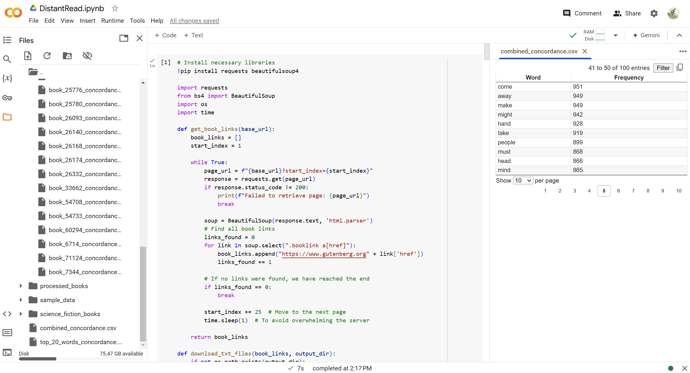

## Tutorial: Working Across Interfaces

This week, we're going to revisit the distant reading we did earlier this semester. However, we'll be approaching the procedural aspects of the project more directly: this will require generating scripts and deploying them to suport each aspect of the process. We'll revisit collecting, processing, and analyzing a data set of texts, but bringing Python scripts directly into play. We'll primarily be making use of a few Python libraries: 

- [Pandas](https://pandas.pydata.org/) is a library for data manipulation and analysis, used to manage CSV files and structured data.
- [BeautifulSoup](https://beautiful-soup-4.readthedocs.io/en/latest/) is a library for parsing HTML and XML, useful for extracting content during web scraping.
- [Requests](https://requests.readthedocs.io/en/latest/) is a library for making HTTP requests in Python, used for downloading data from the web.
- [Matplotlib](https://matplotlib.org/) is a library for creating visualizations like graphs and charts.
- [NLTK](https://www.nltk.org/) is a natural language processing toolkit, used here to filter out stopwords during text preprocessing.

You might find it helpful to look at documentation of these libraries, or even web scraping and distant reading tutorials in Python, for ideas of things to try. While you can install Python directly on your machine to complete these tasks, my demos will be using [Google Colab](https://colab.research.google.com/), a free service for deploying code in different environments - more extensive usage does require paying, but you should have no problems completing these tasks at the free usage level. 

Create a new project for this exercise: we'll be working back and forth between generating and testing Python code. Do not ask ChatGPT to execute any of the code: you will be doing that directly, and in doing so you will be able to work at a much larger scale with access to libraries of existing code (as we started to explore last week).

The interface (shown above) is similar to that of Visual Studio Code: files will appear at the side as you work, and you can pull up those files to verify output at every stage. Add one script at a time by selecting **+CODE**, then press **PLAY** to begin.

### Collecting Our Data

Our first script will enable us to automatically download a large set of texts in a particular category from Project Gutenberg. The sample prompts I used for this process are:

- I want to download all the .txt files of books categorized as American science fiction on Project Gutenberg. The search page is here: https://www.gutenberg.org/ebooks/subject/1198. A sample text file for the first result is here: https://www.gutenberg.org/cache/epub/25024/pg25024.txt. Can you help me write a python script to find and extract all these text files, exhausting the search results?
- Rewrite this to include the pip installs - I'm going to run these scripts on Google Colab.
- This script successfully extracted the first page of results, but there are many more pages of results. The next page of results is formatted as: https://www.gutenberg.org/ebooks/subject/1198?start_index=26 - each page has 25 results, so the index will iterate every time. Can you rewrite the script to continue until it extracts all the results associated with this subject?

This sample downloads from the American Science Fiction subject. Modify the query to select a topic of interest to you with a multi-page result. You might need to debug further, or modify my prompts to reflect errors that arise in your own testing. When successful, you should see all the text files in a sub-folder in your Google Colab workspace.

### Processing Our Data

Next, we're going to run the stopwords and punctuation removal that caused challenges in our previous file processing. We'll be able to access all the text files you've saved and run this as a batch. To avoid duplicating your previous steps, ask for a new scipt every time. I used the sample prompt:

- Write a separate script to check each subfolder for the Project Gutenberg heading and ending text, and remove that text. A sample from the first file looks like: *** START OF THE PROJECT GUTENBERG EBOOK THE NIGHT OF THE LONG KNIVES ***

This is a baseline - you can try further refining it with prompts to remove structured sections of content outside the main text. Use "add code" to add the new script - this way, you can run and debug it separately, as your downloaded files will remain in the folder for further work. Check the text files as you go. 

### Analyzing The Data

There are lots of options for analyzing across your texts: you can try using sentiment analysis or topic modeling, or you can try to use this data towards a creative project (like the markov chains we experimented with earlier). Notice how you can now work more reliably across a much larger dataset. 

Here's my prompts for creating a concordance for the individual texts as well as the full dataset:

- Write a separate script that will continue to pre-process assuming we are creating a concordance. Please get rid of punctuation and use a common stopwords file to eliminate noise. 
- Write another separate script. This one should take the processed texts and output a concordance as a csv for each one.
- Write a next script that takes those concordances and combines them, building a new combined_concordance.csv featuring only the top 100 words from across all books.
- Write another script to visualize the 20 top most frequent words from the combined concordance as a line graph.

Start with this foundation, or take a different approach, and document at least two resulting visualizations. Consider how your process and approach has evolved since our last experiment with distant reading, and refer back to this week's readings on algorithms and variables. How do these literacies influence your relationship to this output? 